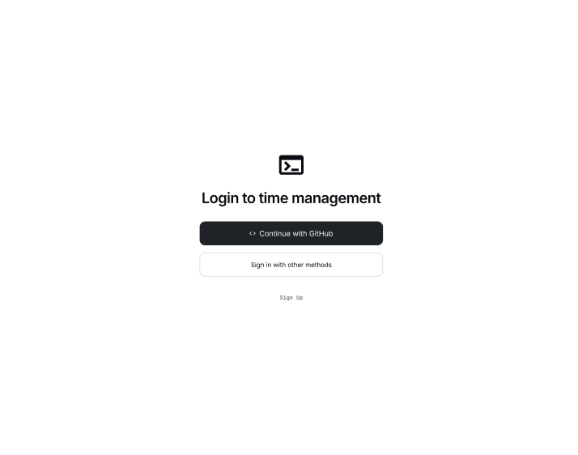
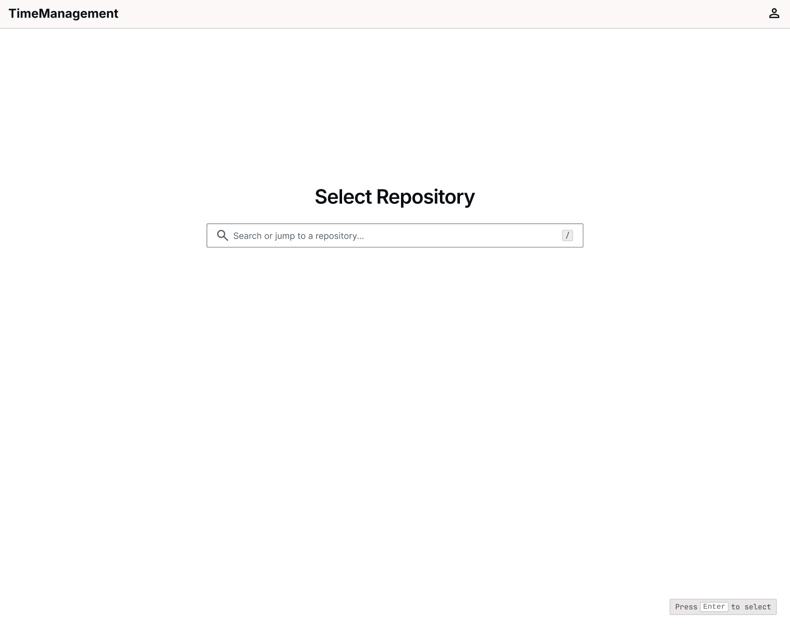
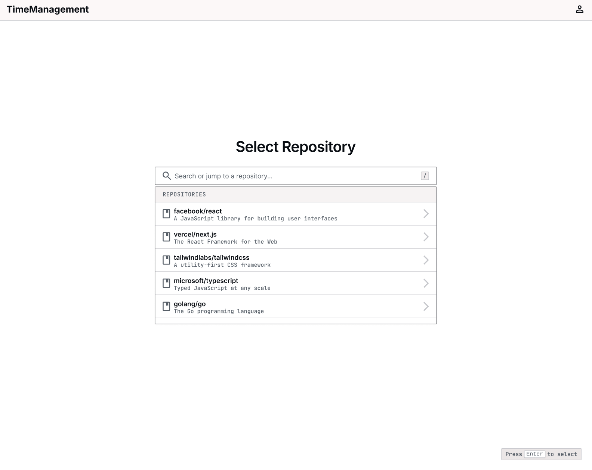
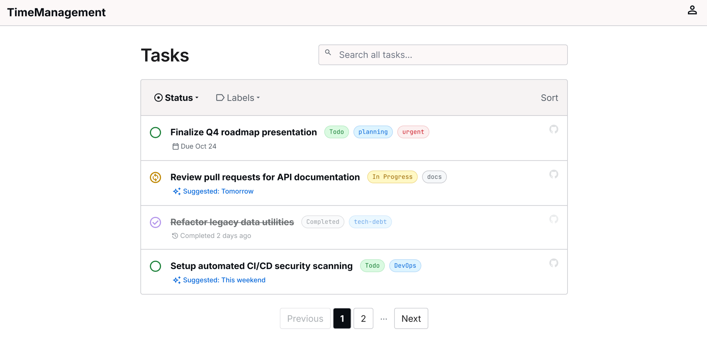
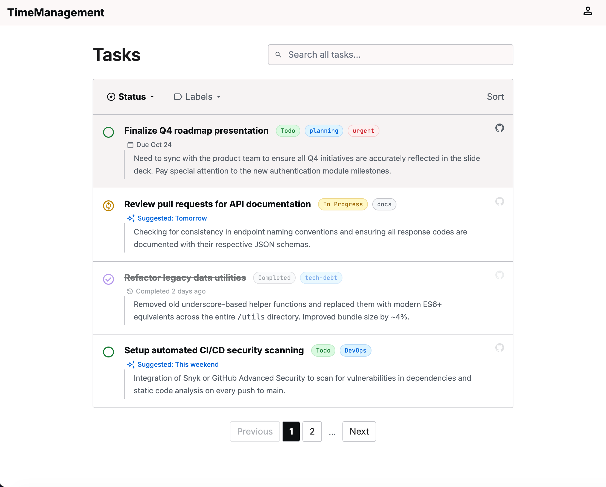
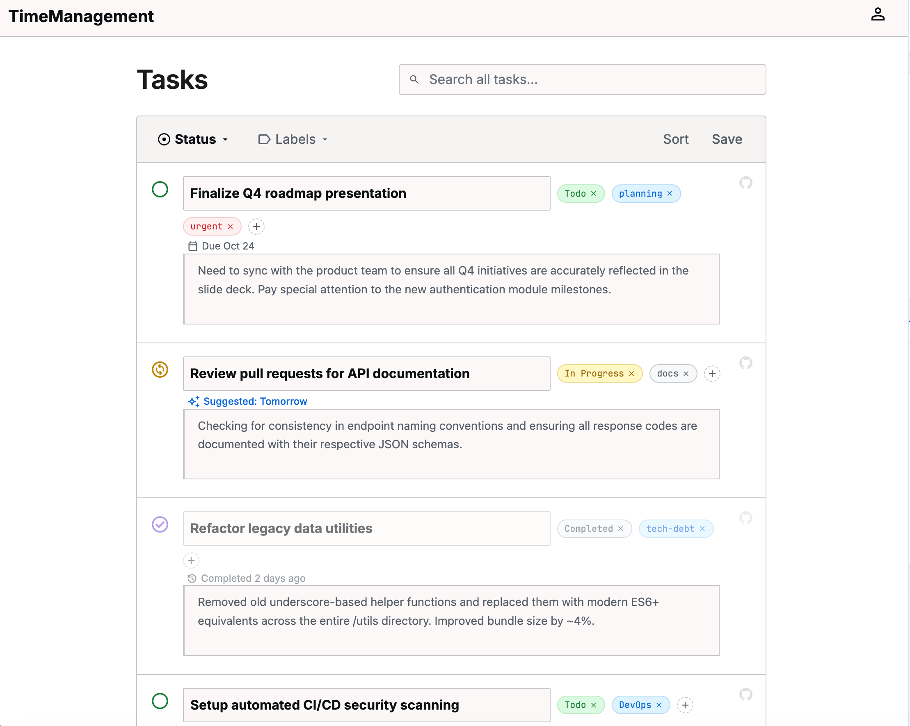

# Proposal-自动任务导入/初始化

## 动机/用户故事

在同时参与多个项目时，需要去查看多个项目的 issue，然后复制到记事本或者其他地方进行记录下来，这不免会降低我们的效率。

## 目标用户

使用 GitHub 进行项目协同开发/管理的人 -> XE 训练营成员就是

## 现有做法及其不足

**现有做法：**

需要手动将 github 上面的 issue 复制到时间管理产品或其他产品上面进行记录还需要手动进行整理。

**不足：** 

1. 需要手动整理记录（耗时耗力，还容易遗漏）
2. 任务及其状态无法及时更新（如：新增任务、任务关闭），无法与时间管理产品进行联动。

## 做与不做

### 做

1. 支持绑定 github 账号
2. 选择单个repository
3. 单向自动同步：将分配给该账号的 issue 同步到时间管理产品上。
4. 争对没有时间相关描述的 issue 提供推荐任务完成时间。

## 不做

1. 不做复杂过滤器，比如按各个维度进行过滤（如：标签）

2. 全量同步历史 issue（优先同步分配给我的开放issue）

3. 不做复杂权限管理（能够获取到仓库、issue、PR 等数据即可）

4. 通过历史关闭任务预测当下以及后续任务的预计耗时。
5. 手动新增任务 item。

## 关键决策与依据

> 决策：是否让 AI 推荐设置没有任何东西可以表述任务开始/结束时间的 issue 的开始/结束时间；结果：让 AI 推荐任务开始/结束时间。
>
> 其他做法：全部 issue/任务 让用户手动填写
>
> 理由：选择“让 AI 推荐任务开始/结束时间”是因为即使推荐有误，用户仍可重新选择。

> 决策：是否全量同步历史 issue；结果：不全量同步历史 issue
>
> 理由：当下历史已关闭的任务对产品后续功能跑通无太大意义

> 决策：同步多个 Repository 还是单个 Repository；结果：单个即可
>
> 理由：如果刚开始就同步多个 Repository 会增加实现的复杂度，单个 Repository 跑通后，后续拓展多个 Repository 就会轻松很多。

## 基本概念与信息结构

**主体内容：**github 账号、github 仓库、issue 任务源

**信息/数据如何组织：**一个 github 账号可以有多个仓库、多个 issue，但时间管理产品中一个任务只对应一个 issue，即本地时间管理产品中一个任务需要关联一个 issueID（为了后续拓展输入源方便可选择为：taskSourceId）。

## 原型/demo

figma 链接：https://www.figma.com/design/MV2UjlVgzG2bqhRzqIOZb5/%E6%97%B6%E9%97%B4%E7%AE%A1%E7%90%86?node-id=0-1&t=T2zW2gYOmR6bUQqG-1

1. 第一次打开产品第一眼看到的内容【登录】

   

2. 登录完成后选择需要同步任务的仓库

   

   

3. 初始化任务列表（初始化->任务时间、任务状态等,以及任务优先级）

   

4. 任务初始化完成(可编辑标题、标签、时间、描述)，点击 github 头像跳转到 github issue 原地址处

   

   

   

## 验收标准

> 最低交付：
>
> 1. 可以登录
>2. 可以查看仓库列表
> 3. 初始化任务列表且所有待办项的基础数据初始化完毕（如：时间、状态）

