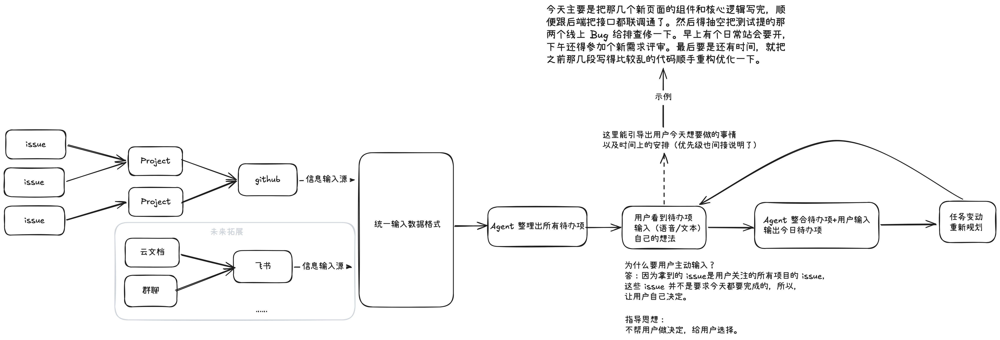

# Proposal-自动任务导入/初始化

## 动机/用户故事

在同时参与多个项目时，需要去查看多个项目的 issue，然后复制到记事本或者其他地方进行记录下来，这不免会降低我们的效率。

## 目标用户

使用 GitHub 进行项目协同开发/管理的人

## 现有做法及其不足

**现有做法：** 需要手动将 github 上面的 issue 复制到时间管理产品或其他产品上面进行记录。

**不足：** 

1. 需要手动
2. 任务状态无法及时更新（如关闭），无法与时间管理产品进行联动。

## 做与不做

### 做

1. 支持绑定 github 账号
2. 单向自动同步：将分配给该账号的 issue 同步到时间管理产品上且监听任务状态。
3. 争对没有时间相关描述的 issue 提供推荐任务完成时间。

## 不做

1. 不做复杂过滤器，比如按各个维度进行过滤（如：标签）

2. 全量同步历史 issue（优先同步分配给我的开放issue）

## 关键决策与依据

> 决策：是否让 AI 推荐设置没有任何东西可以表述任务开始/结束时间的 issue 的开始/结束时间；让 AI 推荐任务开始/结束时间。
>
> 其他做法：全部 issue/任务 让用户手动填写
>
> 选择“让 AI 推荐任务开始/结束时间”是因为即使推荐有误，用户仍可重新选择。

## 基本概念与信息结构

**主体内容：**github 账号、github 仓库、issue 任务源

**信息/数据如何组织：**一个 github 账号可以有多个仓库、多个 issue，但时间管理产品中一个任务只对应一个 issue，即本地时间管理产品中一个任务需要关联一个 issueID（为了后续拓展输入源方便可选择为：taskSourceId）。

## 原型/demo

**文字描述原型：**

【前提】设置界面  --> github 绑定账号选项  --> 授权绑定账号  --> 选择关注的仓库任务

设置界面 --> 勾选自动同步 github issue（如不勾选，需每次手动同步）

首页 --> 以仓库分类展示 任务 及其 任务 状态。

## 验收标准

> 最低交付：
>
> 可在产品中查看所有的待办项。
>
> 即：同步所有选定的仓库且分配给该账号开放状态的issue。

## 其他：个人对产品的鸟瞰想法

> 误解：Project 不等于仓库中的 Projects 面板（任务面板），这里信息输入源中的 Project 指的是项目仓库。