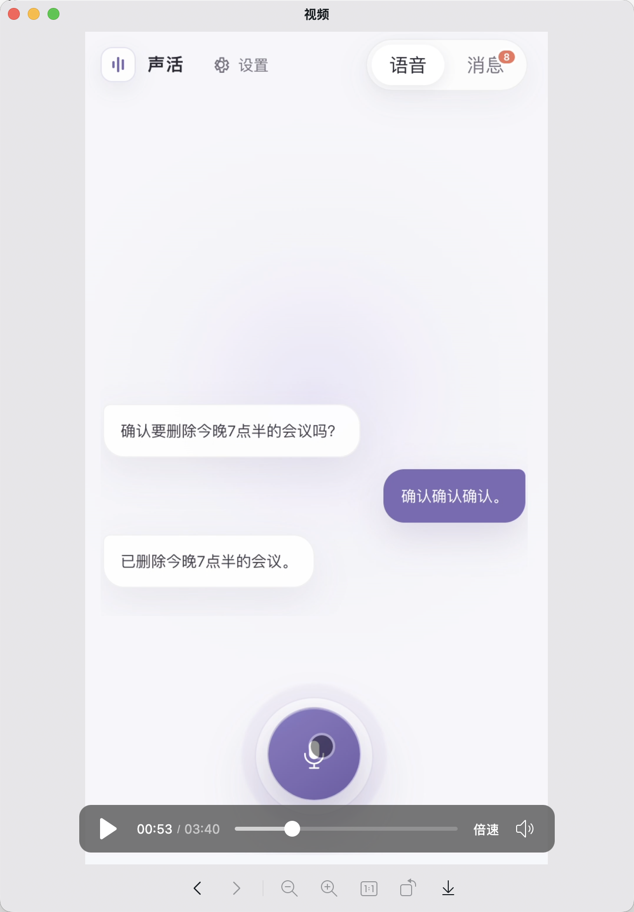

# Proposal 1：语音创建与查询

## 1. 动机 / 用户故事

**动机：**在日常生活中，大家或多或少都有一些琐事，下楼买个牙膏、拿个快递、聚餐位置等等，对很多人来说都是靠脑子记，做的更多一点的就是把这些信息发送到微信“个人传输助手”之类的。

**用户故事 ：**早上刷牙发现没牙膏了，你费力挤了一点出来，你说晚上下班记得买，下了班之后，按照往常习惯直接就上楼了，到了第二天早上又发现没有牙膏了，只能再费点力挤出来，然后说下班买，下了班之后又直接上了楼，可能只有偶然到了楼下才突然记得要买牙膏才会去买，或者专程去买。用微信/记事本之类的产品同样也得记住要买才行。

**用户故事：**你开车去聚餐，把车停到了停车场，等聚餐完事后才发现刚才太嗨了，完全忘记了车停哪里，你在停车场转悠了半小时才找到车在哪里。

---

**共同需求：**这些事情都不大，当时没想着记，但事后就忘记了。或者说记录门槛太高、太麻烦了，没必要。

## 2. 目标用户

那些为生活小事而苦恼的人、日常琐事多、觉得打字太麻烦了、找来找去太麻烦了、需要提醒。

1. 早晚通勤、生活节奏紧凑的上班族。
2. 同时兼顾家庭琐事和工作的职场人。
3. 记忆力一般、不刻意记就容易忘的人。

## 3. 现有做法及其不足
1. 脑子记——不刻意去记的话，一些小事没有提醒就是转瞬即逝的。
2. 微信、记事本、备忘录——打开-打字-手动管理，全手动，操作成本太大了。
3. 第三方产品（比如：番茄 TODO 之类的）——这类产品没有专门针对碎片化琐事设计，更多的事针对后续规划来设计的一款产品。
4. Siri 类似的语音助手——这些产品能帮你做，不过还是不够智能，在同一时间点可以设置两个冲突的事（比如：晚上 10 点提醒我睡觉，晚上 10 点提醒我打游戏，都能设置成功，并且没有任何提醒）、没有统一的记录视图、不支持后续询问、不适合做生活日志。

## 4. 本期范围与明确不做

### 4.1 本期做

本期不做多了，完成一个小闭环即可，通过语音输入告诉它帮我记一件事、提醒一件事就好。
1. 记一件事
2. 提醒一件事
3. 查询一件事

**注：**并非只能记一件事和提醒一件事，N 件事也可以。

### 4.2 本期明确不做
1. 第三方平台日历事项同步
2. 复杂的周期性提醒不做
3. 场景化不做——虽然有点意思，但是也有点复杂
4. 第三方平台数据输入到我们平台——虽然有了更多数据可以玩出更多花来，但是对主干来说没有任何影响和语音输入是等价的。
5. 多模态创建——语音这条路走通了，其他模态自然也没什么问题。

## 5. 关键决策与依据

**选项：**

1. 客户端直连大模型？
2. 客户端先连接后端，后端连接大模型？

**决策：**选 1，如果客户端先连接后端，再连接大模型，那么对于用户本地的一些操作就太漫长了，比如一个 function calling 的结果需要给到后端，再给到客户端，但是如果客户端直连大模型，整体的交互就丝滑很多了。

---

**选项：**

1. 使用灵矽 AI平台进行语音交互
2. 自己对接 API 完成 ASR->LLM->TTS

**决策：**选 1，自己也可以实现，但是没必要，别人做好了，就没必要重复造轮子，后续需求满足不了了再做调整，可在架构上保留设计。

## 6. 基本概念与信息结构

**基本概念：**
1. 记一件事：将这件事存起来，在需要时被提及。
2. 提醒一件事：用户主动说明的时间点提醒，模糊的时间点不提醒。
3. 查询一件事：用户问起来，你得知道有没有这件事。

**信息结构：**

**事项：**

- 标题
- 内容
- 类型（记录/提醒）
- 创建时间

类型为：记录时下面字段为空

- 提醒时间
- 状态（待提醒、已提醒、已超时【未提醒】）

**记一件事：**会让事项列表新增一条数据

**提醒：**触发定时任务

**查询：**从事项列表中提取出数据

**其他：**一条语音可能产生多条事项

## 7. 原型 / Demo

详细可见团队群视频

## 8. 验收标准
1. 用户能按住按钮说话，产品有语音反馈（比如：已经帮你记下了，明天早上 10 点开会）。
2. 能实时展示用户语音转换文本的内容，确保语音和转换后的文本语义一致。（比如：用户按住按钮说“明天下午三点提醒我开会”，系统转换文本为”明天下午三点提醒我开会“）
3. 将用户需要记录/提醒的事归类展示（在任务列表展示用户说过的所有记录事项——事项列表按类型分 tab 展示：全部、记录、提醒）。
4. 用户能够询问记录的事项（比如：下班要干什么来着）。

**异常情况：**

1. 输入内容语义不明确（比如：有环境噪音识别不精确之类的），产品应给出明确反馈或向用户确认。
2. 用户要求提醒，但未给出明确时间节点，转换为记录事项，并向用户询问具体时间节点，如用户给出具体时间节点则转换为提醒事项。
3. 用户要求提醒，但时间节点已成为过去式，比如现在 4 点，但是用户要求 2 点提醒，告知用户时间已经过去了，是否记录下来或者改个时间。
4. 单次输入多条事项时（比如：我车停在了 A130，另外明天早上 10 点提醒我开会），要正确拆分为记录事项和提醒事项。